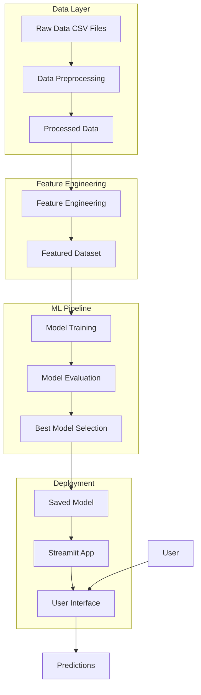

# High-Level Design (HLD) Document
## Cryptocurrency Liquidity Prediction System

---

## 1. Executive Summary

This document describes the high-level architecture of a Machine Learning system that predicts cryptocurrency liquidity levels to help traders and financial institutions assess market stability and manage risks.

---

## 2. System Architecture

---

## 3. Technology Stack

| Layer | Technology |
|-------|------------|
| **Programming Language** | Python 3.12 |
| **Data Processing** | Pandas, NumPy |
| **Machine Learning** | Scikit-learn, XGBoost |
| **Visualization** | Matplotlib, Seaborn, Plotly |
| **Web Framework** | Streamlit |
| **Model Persistence** | Joblib |

---

## 4. Component Overview

### 4.1 Data Layer
- **Input**: CoinGecko cryptocurrency data (price, volume, market cap, changes)
- **Processing**: Missing value handling, normalization, data cleaning
- **Output**: Clean, consistent dataset ready for feature engineering

### 4.2 Feature Engineering Layer
- **Liquidity Ratio**: Volume/Market Cap (primary target)
- **Volatility Score**: Standard deviation of price changes
- **Turnover Rate**: Normalized trading volume
- **Market Dominance**: Percentage of total market cap
- **Momentum Indicators**: Short, medium, long-term trends

### 4.3 ML Pipeline Layer
- **Models**: Linear Regression, Ridge, Random Forest, Gradient Boosting, XGBoost
- **Training**: 80/20 train-test split with cross-validation
- **Tuning**: GridSearchCV for hyperparameter optimization
- **Selection**: Best model based on R² score

### 4.4 Deployment Layer
- **Interface**: Streamlit web application
- **Features**: Dashboard, Prediction, Analysis pages
- **Visualization**: Interactive charts with Plotly

---

## 5. Data Flow

1. **Ingestion**: Load raw CSV files from `data/raw/`
2. **Preprocessing**: Clean, normalize, save to `data/processed/`
3. **Feature Engineering**: Create liquidity-related features
4. **Training**: Train multiple models, select best performer
5. **Persistence**: Save model to `models/`
6. **Serving**: Load model in Streamlit app for predictions

---

## 6. Security Considerations

- No external API calls required (offline model)
- Data stored locally only
- No user authentication needed for MVP

---

## 7. Scalability

| Aspect | Current | Future |
|--------|---------|--------|
| Data Size | ~1000 records | Can scale to millions |
| Model | Single model | Ensemble/Deep Learning |
| Deployment | Local Streamlit | Cloud (AWS/GCP) |
| Updates | Manual | Automated pipeline |

---

## 8. Limitations

1. Dataset from 2022 - may not reflect current market conditions
2. No real-time data feed integration
3. Social media sentiment not included (not in dataset)
4. Liquidity is approximated using Volume/MarketCap ratio

---

## 9. Future Enhancements

- Real-time data integration via CoinGecko API
- Deep learning models (LSTM for time-series)
- Sentiment analysis from Twitter/Reddit
- Cloud deployment with automated retraining
