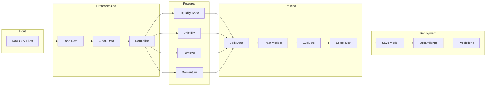
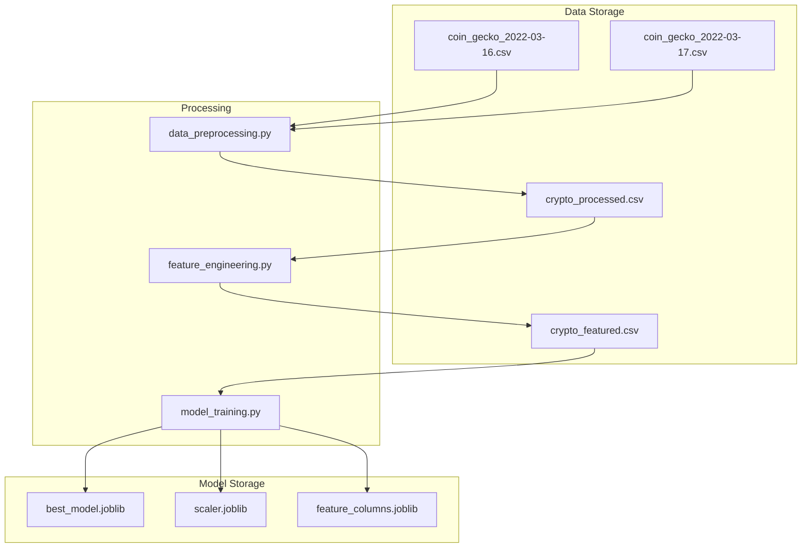
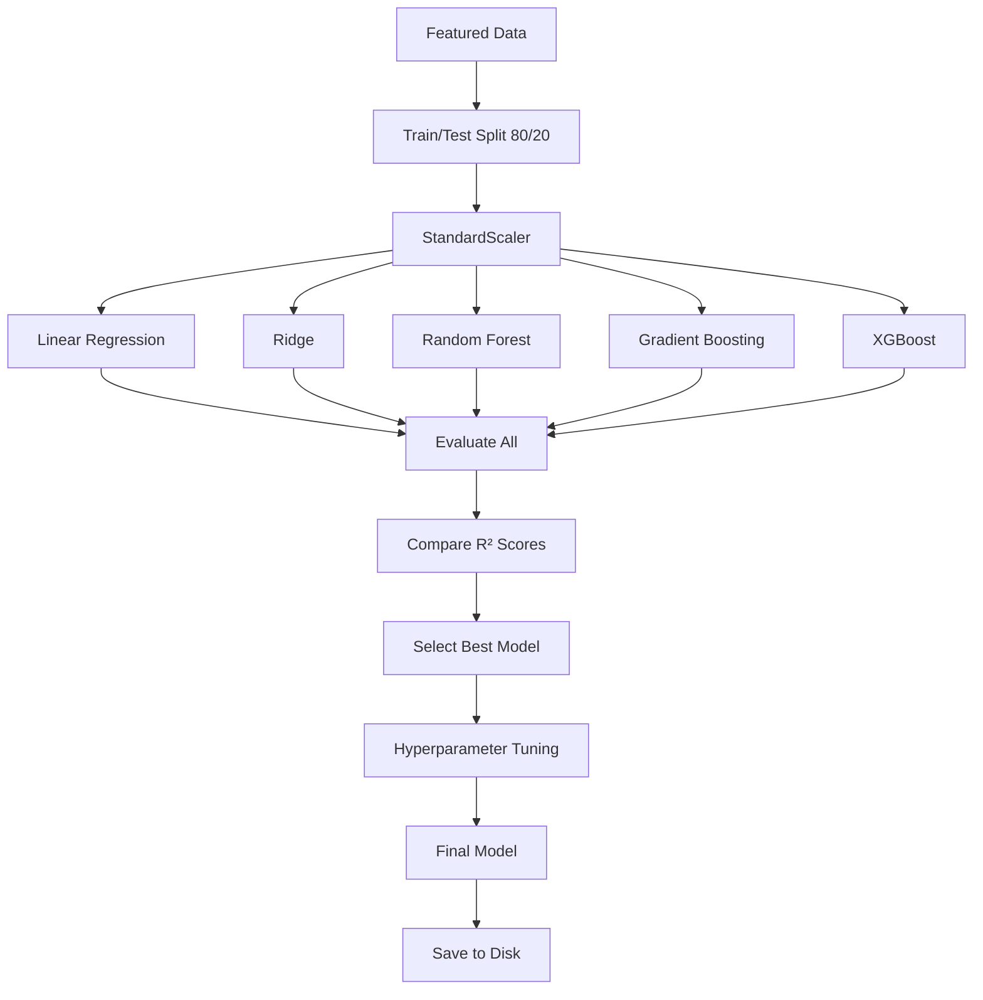

# Pipeline Architecture Document
## Cryptocurrency Liquidity Prediction System

---

## 1. End-to-End Pipeline Overview



---

## 2. Pipeline Stages

### Stage 1: Data Ingestion
- **Input**: `data/raw/*.csv`
- **Process**: Load and merge all CSV files
- **Output**: Combined DataFrame

### Stage 2: Data Preprocessing
- **Input**: Raw DataFrame
- **Process**: Clean, handle missing values, normalize
- **Output**: `data/processed/crypto_processed.csv`

### Stage 3: Feature Engineering
- **Input**: Preprocessed data
- **Process**: Create liquidity-related features
- **Output**: `data/processed/crypto_featured.csv`

### Stage 4: Model Training
- **Input**: Featured dataset
- **Process**: Train multiple models, tune, evaluate
- **Output**: `models/best_model.joblib`

### Stage 5: Deployment
- **Input**: Saved model + data
- **Process**: Streamlit web application
- **Output**: Interactive predictions

---

## 3. Execution Commands

```bash
# Step 1: Install dependencies
pip install -r requirements.txt

# Step 2: Run preprocessing
python src/data_preprocessing.py

# Step 3: Run feature engineering
python src/feature_engineering.py

# Step 4: Train models
python src/model_training.py

# Step 5: Evaluate models (optional)
python src/model_evaluation.py

# Step 6: Launch web app
streamlit run app/streamlit_app.py
```

---

## 4. Data Flow Diagram



---

## 5. Feature Pipeline

| Stage | Input Features | Output Features |
|-------|---------------|-----------------|
| Raw | coin, symbol, price, 1h, 24h, 7d, volume, mcap, date | - |
| Clean | All raw | Renamed, nulls handled |
| Normalize | price, volume, mcap | + _normalized versions |
| Engineer | All cleaned | + liquidity_ratio, volatility_score, turnover_rate, etc. |

---

## 6. Model Pipeline



---

